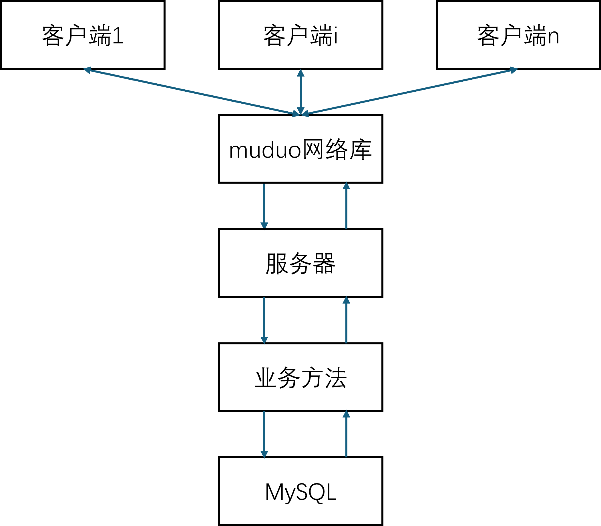

# ChatServer
项目说明: 
1. 基于muduo的群聊系统, 使用muduo网络库作为网络核心模块, 提供稳定可靠的高并发服务 
2. 对网络模块和业务模块进行解耦, 实现面向对象封装思想 
3. 使用json完成通信, 通过序列化与反序列化操作, 实现对传输消息的解析 
4. 使用MySQL关系型数据库对项目数据进行存储 

整体流程图如下: 

项目所需组件:  
该项目需要安装cmake, mysql, boost, muduo网络库组件  
安装cmake命令: sudo apt-get install cmake  
安装mysql数据库与开发工具: sudo apt-get install mysql-server, sudo apt-get install libmysqlclient-dev  
boost库与muduo网络库安装: 参考https://www.cnblogs.com/conefirst/articles/15224039.html

项目运行: 
1. mysql数据库建数据库chat, 并使用chat_db.sql建立表(该项目中数据库使用的用户为root, 密码为123456) 
2. 执行autobuild.sh生成bin目录下的可执行文件 
3. bin目录下先运行./ChatServer ip port启动服务器, 其中ip, port分别代表ip地址和端口号, 再运行./ChatClient ip port启动客户端

项目可改进点: 
1. 可以使用nginx将目前的单服务器系统改进为多服务器系统, 实现负载均衡并且提供更高的容错率 
2. 当升级为多服务器系统后, 可以使用redis的订阅系统实现不同服务器上的客户端通信